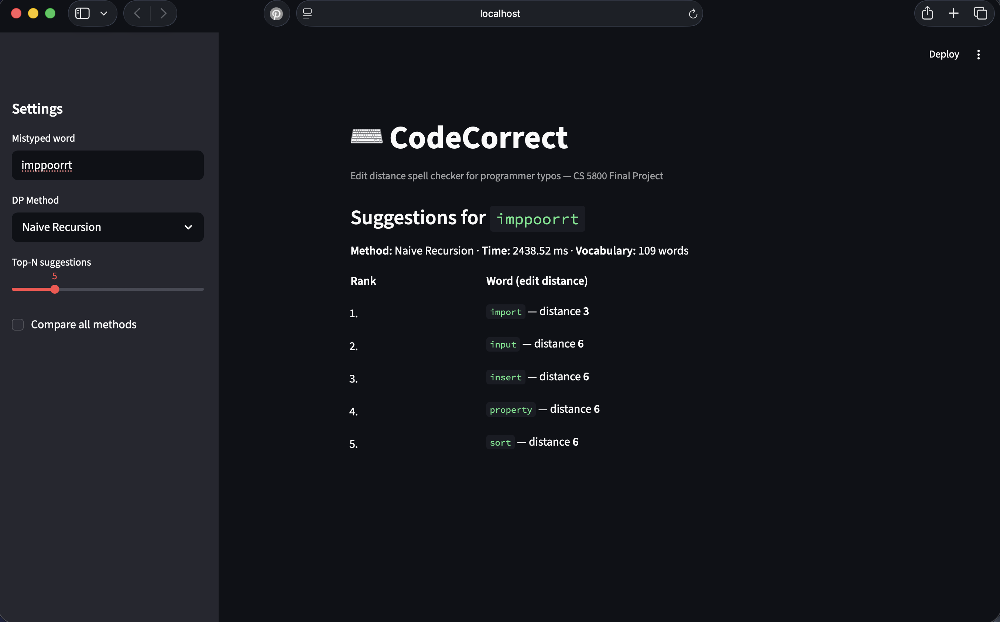
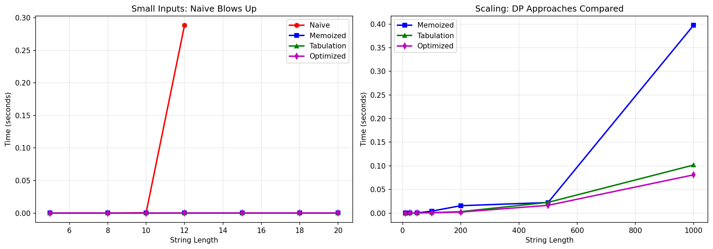

# CodeCorrect

> **CS 5800: Algorithms — Spring 2026 — Northeastern University**  
> Instructor: Dr. Lama Hamandi

A Python-based spell-checker for programmer typos — built on edit distance (Levenshtein distance) and dynamic programming.

## Demo

[](https://youtu.be/fuGO9O2CPAc)

A walkthrough of CodeCorrect showing CLI usage with a live typo correction example, the Streamlit web app comparing all four DP implementations simultaneously, and benchmark results visualizing the performance gap between naive recursion and tabulation-based approaches.

**→ [Setup & Usage Guide](SETUP.md)** — installation, CLI usage, Streamlit demo, testing, repo structure

---



---

## The Problem

Every programmer has been bitten by a typo: `pritn` instead of `print`, `lenght` instead of `length`, `retrun` instead of `return`. Unlike natural language, code typos don't just look wrong — they crash your program. Most IDEs underline errors but don't suggest corrections for arbitrary identifiers.

**Our question:** Given a mistyped token, how can we use edit distance to instantly suggest the closest valid match from a known vocabulary — and how does the choice of DP strategy affect real-time performance?

Motivated by **CLRS 3rd Edition, Chapter 15 (Dynamic Programming)** and **Problem 15-5** (edit distance with twiddle/transposition operations).

---

## Team

| Member | Primary Responsibilities |
| --- | --- |
| **Atharv Chaudhary** | Bottom-up tabulation, space-optimized variant, benchmarking framework, performance plots, complexity proofs, Streamlit demo, repository integration |
| **Sandeep Vijayarao** | Naive recursive + memoized implementations, real-world typo dataset collection, accuracy evaluation |
| **Scott Biggs** | CodeCorrect CLI integration (vocab loading, ranking, output formatting), presentation slides, live demo |

Report writing, presentation prep, and Q&A rehearsal are shared across all three members.

---

## Algorithms

All three implementations solve the same problem: compute the minimum number of single-character edits (insert, delete, replace) to transform string `s1` into string `s2`.

### 1. Naive Recursion — `src/naive.py`

Pure recursive solution. Recomputes overlapping subproblems repeatedly — exponential blowup.

```text
edit_distance(s1, s2):
  if s1 is empty: return len(s2)
  if s2 is empty: return len(s1)
  if s1[-1] == s2[-1]: return edit_distance(s1[:-1], s2[:-1])
  return 1 + min(
    edit_distance(s1[:-1], s2),      # delete
    edit_distance(s1, s2[:-1]),      # insert
    edit_distance(s1[:-1], s2[:-1]) # replace
  )
```

| | Complexity |
| --- | --- |
| Time | O(3^(m+n)) |
| Space | O(m+n) — recursion stack |

### 2. Top-Down Memoization — `src/memoized.py`

Same recurrence as naive, but caches results in a `memo` dict so each `(i, j)` subproblem is solved exactly once.

| | Complexity |
| --- | --- |
| Time | O(m × n) |
| Space | O(m × n) memo table + O(m+n) stack |

### 3. Bottom-Up Tabulation — `src/tabulation.py`

Iteratively fills an `(m+1) × (n+1)` DP table. No recursion overhead. Includes a space-optimized rolling two-row variant.

| | Complexity |
| --- | --- |
| Time | O(m × n) |
| Space | O(m × n) full table, O(min(m,n)) space-optimized |

---

## Benchmark Results

We benchmarked all four approaches (naive, memoized, tabulation, space-optimized) on randomly generated string pairs with controlled mutations. Naive was capped at length 12 due to exponential blowup.

| String Length | Naive (s) | Memoized (s) | Tabulation (s) | Optimized (s) |
| --- | --- | --- | --- | --- |
| 5 | 0.000161 | 0.000015 | 0.000013 | 0.000003 |
| 10 | 0.000618 | 0.000019 | 0.000013 | 0.000009 |
| 12 | 0.288630 | 0.000049 | 0.000018 | 0.000012 |
| 15 | SKIPPED | 0.000187 | 0.000024 | 0.000017 |
| 100 | SKIPPED | 0.004097 | 0.000939 | 0.000603 |
| 500 | SKIPPED | 0.022329 | 0.022629 | 0.016394 |
| 1000 | SKIPPED | 0.397506 | 0.101660 | 0.080865 |

**Key findings:**

- Naive recursion hits 0.29s at length 12 — unusable beyond trivial inputs
- Memoized is ~4× slower than tabulation at length 1000 due to Python dict overhead
- Space-optimized rolling-row variant is consistently ~20% faster than full-table tabulation
- At length 500, memoized (0.022 s) and tabulation (0.023 s) are approximately equal — the performance gap only becomes clear at length 1,000, confirming that constant-factor effects require large inputs to become visible




## Testing

Run the full test suite with:

```bash
pytest tests/ -v
```

175 tests pass across all four implementations. The strongest coverage is cross-implementation consistency — naive, memoized, and tabulation are verified to produce identical edit distances on the same inputs, confirming algorithmic correctness across all variants.

---

## CLRS Connections

| Topic | Connection |
| --- | --- |
| **Dynamic Programming (Ch. 15)** | Edit distance exhibits optimal substructure and overlapping subproblems — the two hallmarks of DP |
| **CLRS Problem 15-5** | The "twiddle" (transposition) operation models `pritn → print`, the dominant typo class in code (discussed, not implemented) |
| **Growth of Functions (Ch. 3)** | We prove O(3^(m+n)) for naive vs. O(mn) for DP and validate empirically with timing benchmarks |
| **Sorting (Ch. 2, 8)** | Candidates are sorted by edit distance to extract top-k suggestions efficiently |

---

## Project Timeline

| Week | Dates | Tasks | Owner | Status |
| --- | --- | --- | --- | --- |
| 1 | 3/9–3/16 | Naive + memoized implementations; vocab loader | Sandeep | ✅ Done |
| 2 | 3/16–3/23 | Bottom-up tabulation; space-optimized variant; 28 unit tests | Atharv | ✅ Done |
| 3 | 3/23–3/30 | CLI integration; scale to 50K vocab; typo testing | Scott | ✅ Done |
| 4 | 3/30–4/6 | Benchmark plots; Progress Report 2; branch cleanup | All | ✅ Done |
| 5 | 4/6–4/18 | Final report, slides, demo, rehearsal; finalize submission | All | ✅ Done |

All feature branches have been merged into `main` and deleted.

---

## Scope

**In scope:**

- Edit distance implemented three ways (naive, memoized, tabulated) + space-optimized variant
- Working CLI autocorrect tool with top-k ranking
- Streamlit demo frontend for live presentations
- Benchmarks and performance plots across string lengths
- Formal time/space complexity proofs for each approach
- CLRS Problem 15-5 twiddle operation discussion

**Out of scope:**

- IDE plugins or VS Code extensions
- Machine learning or statistical language models
- Multi-token corrections or syntax-level analysis

---

## License

MIT — see [LICENSE](LICENSE)
